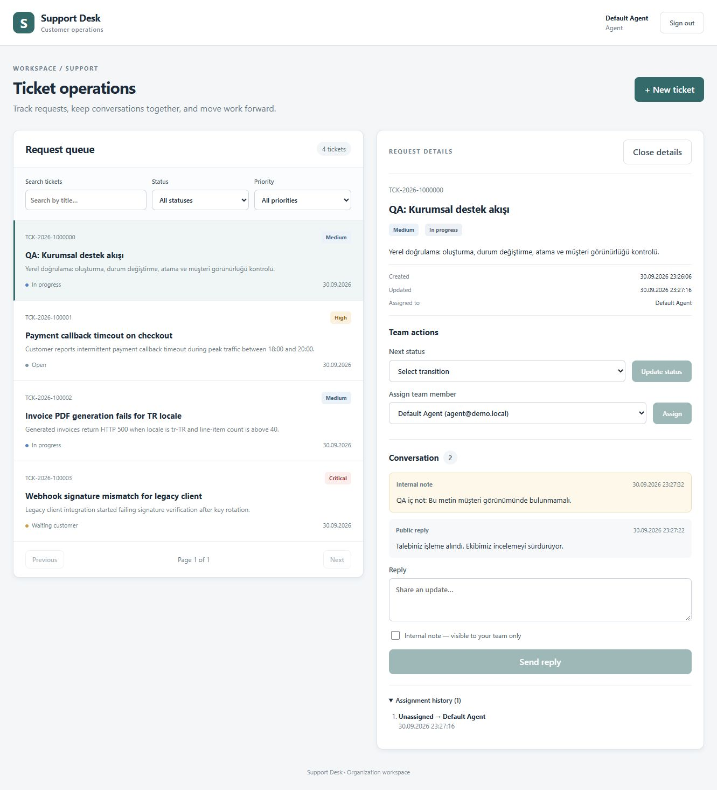
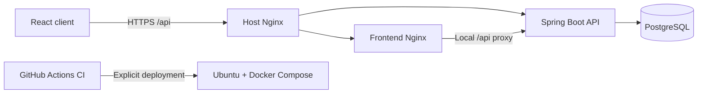

# B2B Support Desk

[](https://github.com/hayro45/b2b-support/actions/workflows/ci-cd.yml)

A small-team support desk built with Java 21, Spring Boot, PostgreSQL, React and TypeScript. It demonstrates tenant-scoped authorization, a ticket lifecycle, transactional audit history, database migrations and single-server operations.

[Hosted instance](https://support.hayrettindal.com) · [Architecture](docs/architecture/mvp-implementation-plan.md) · [Deployment and recovery](docs/runbook/ubuntu-single-server-deploy.md) · [Backlog](docs/backlog/sprint-backlog.md)

The hosted instance requires a private owner account; public demo credentials work only locally. Changes in this checkout are not automatically live. Use fictional data only. [Production security verification](docs/verification/2026-10-01-production.md) records the deployed revision and checks.



[Customer workspace](docs/screenshots/customer-workspace.jpg) · [320 px mobile view](docs/screenshots/customer-mobile.jpg)

## Product workflow

1. A customer signs in, creates a ticket, searches their organization's queue and adds public comments.
2. An agent opens its detail view, assigns an active teammate and advances the ticket through allowed status transitions.
3. Staff can add internal notes and inspect assignment history. Customers cannot read internal notes or staff assignment history.
4. Ticket changes and their audit/history entries commit together. Conflicting concurrent ticket updates return HTTP 409.

Customers intentionally share all tickets within their organization. This is an organization-wide support inbox, not a private per-requester inbox. Different organizations cannot access each other's tickets, comments or agent directory.

## Architecture



- Feature-oriented backend packages: `auth`, `ticket`, `audit`; API DTOs are separate from JPA entities.
- Flyway owns schema changes; Hibernate validates the schema. Historical V1–V5 migrations are preserved.
- JWT tokens live in browser memory and expire; reload requires sign-in. The API verifies the current user's active status and authorization.
- Ticket writes are transactional. Ticket numbers use a database sequence, and optimistic locking protects concurrent writes.
- A single host keeps costs and operational complexity appropriate for 5–6 users. High availability is outside this MVP.

## Local development

Requirements: Docker Engine/Desktop with Linux containers, or Java 21 + Maven 3.9 and Node 24 LTS for running individual services.

```powershell
Copy-Item .env.example .env
docker compose --env-file .env -f infra/docker-compose.yml up -d --build --wait
```

- App: <http://localhost:3000>
- API: <http://localhost:8080/api/v1/tickets>
- OpenAPI: <http://localhost:8080/swagger-ui/index.html>

Local accounts: `agent@demo.local` and `customer@demo.local`, password `demo12345`. They are development fixtures. The production profile disables seeded demo accounts; production must use separately provisioned users with encoded passwords.

To develop the frontend against a running backend:

```powershell
cd frontend
npm ci
npm run dev
```

Vite proxies `/api` to localhost:8080. The frontend container also proxies `/api`, so local Compose works without a separate host Nginx.

## Verification

[Local hardening results and remaining deployment work](docs/verification/2026-10-01-hardening.md)

```powershell
cd frontend
npm ci
npm run lint
npm test
npm run build
npm audit
```

```powershell
cd backend
mvn -B verify
```

Backend integration tests run against real PostgreSQL through Testcontainers and require a running Docker engine. CI runs the backend suite, frontend checks and container/configuration checks. Deployment is a separate, explicitly triggered operation; consult the runbook before using real data.

## API outline

| Endpoint | Purpose | Roles |
| --- | --- | --- |
| `POST /api/v1/auth/login` | Sign in | Public, throttled |
| `GET /api/v1/auth/me` | Current user | Authenticated |
| `GET /api/v1/auth/agents` | Active organization staff | Agent, admin |
| `GET /api/v1/tickets` | Combined status/priority/title filters and paging | All |
| `POST /api/v1/tickets` | Create ticket | All |
| `GET /api/v1/tickets/{id}` | Ticket detail | All |
| `PATCH /api/v1/tickets/{id}/status` | Validated status transition | Agent, admin |
| `PATCH /api/v1/tickets/{id}/assign` | Assign active organization staff | Agent, admin |
| `GET/POST /api/v1/tickets/{id}/comments` | Read/add comments | All; internal notes staff-only |
| `GET /api/v1/tickets/{id}/assignment-history` | Assignment timeline | Agent, admin |

Paging is bounded (`size` 1–100) and sorting uses an allowlist. Errors use JSON codes and meaningful HTTP statuses. There is no public user-registration endpoint.

## Deliberate limits

SLA automation, file uploads, email notifications, SSO, multi-node throttling and high availability are not implemented. Comments currently return the newest bounded set; full comment/history pagination remains in the backlog. Existing database timestamps retain their original schema; a future UTC migration needs a documented timezone assumption.

The project is an MVP with production safeguards, not a claim of enterprise certification. [The backlog](docs/backlog/sprint-backlog.md) distinguishes completed work from remaining work.
