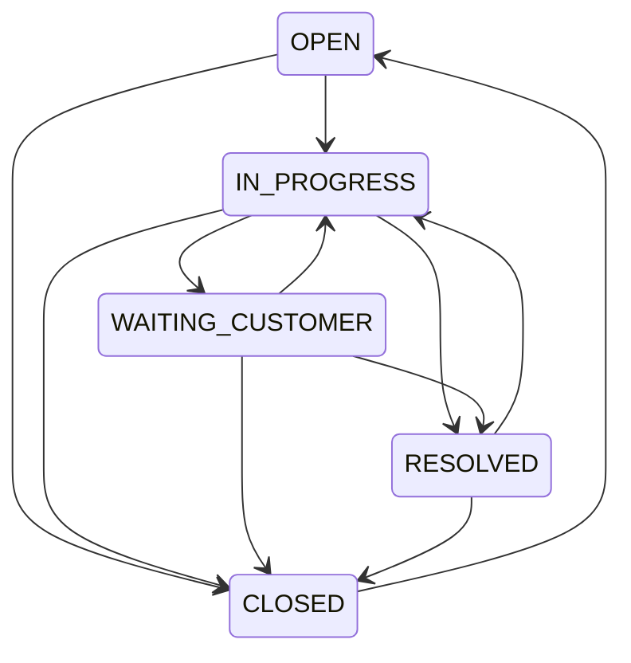

# MVP architecture and decisions

## Scope

B2B support operations for one small team (initial target: 5–6 users). The repository is a monorepo with a Spring Boot API, React client, PostgreSQL database, Docker Compose deployment and operations scripts. The architecture is a feature-oriented monolith.

## Decisions and trade-offs

| Decision | Reason | Accepted limitation |
| --- | --- | --- |
| Java 21 and Spring Boot | Stable Java baseline and established Spring integration | Upgrade patches regularly |
| React + TypeScript + Vite | Small, typed client with a short build cycle | Browser-only application; no SSR requirement |
| PostgreSQL + Flyway | Relational constraints, migrations and transaction support | Historical migrations are immutable once applied |
| Same origin `/api` | Simple browser integration and one TLS endpoint | Reverse proxy routing must preserve `/api` |
| One Ubuntu host + Compose | Appropriate cost and complexity for the target team | Host failure causes downtime; off-host backups are necessary |
| Explicit deployment after CI | Provisioning/secrets cannot silently break every push | Operator owns production readiness and deployment timing |
| In-memory login throttling | Basic protection for a single API instance | Restart resets counters; multiple replicas need shared state |
| Browser-memory JWT | Avoid persistent token storage | Reload signs the user out; no refresh-token flow |

## Authorization policy

Identity includes user, organization and role. The server scopes each ticket lookup to the authenticated organization. Customers can see all their organization's tickets and public comments; this shared-inbox policy is intentional. Staff-only actions include status updates, assignment, internal notes, assignment history and the active agent directory.

The API validates user activity after token issuance, so disabling an account invalidates its access. Production disables the historical demo accounts. Development fixtures are retained for reproducibility; they are not production identities.

## Consistency

Ticket creation, status changes, assignment and comments write audit/history records in the same transaction. Failure rolls back the entire operation. Assignment requires an active AGENT or ADMIN in the same organization. Valid status changes are:

Ticket numbers come from a PostgreSQL sequence rather than random six-digit values. Optimistic locking detects concurrent writes that overlap on the same ticket. A future API version can add client version preconditions to detect changes made before a new request starts as well.

Status, priority and title filters combine. Pagination and sorting are bounded and validated; title search escapes SQL wildcard characters. Internal notes are filtered in the database before applying the customer's result limit.

## Production boundary

Production uses the `prod` Spring profile and the Compose production override. Secrets are supplied explicitly. Demo users are disabled and active plaintext-password users are rejected. TLS terminates at host Nginx; the service ports are bound to localhost and PostgreSQL is not published. Containers use non-root application users. Backups and recovery are described in the runbook.

Image rollback restores application binaries; it does not undo Flyway schema changes. New migrations should be backward-compatible with the previous application version. Restoring a database backup can discard newer records and is an operator-controlled recovery decision.

## Remaining design work

- UTC timestamp migration: infer the original timezone explicitly before converting existing records.
- Full comment/assignment-history pagination and audit-log operator views.
- User provisioning and password-management workflow.
- SLA policy, breach detection and operational dashboard.
- More resilient hosting only when availability requirements justify it.
