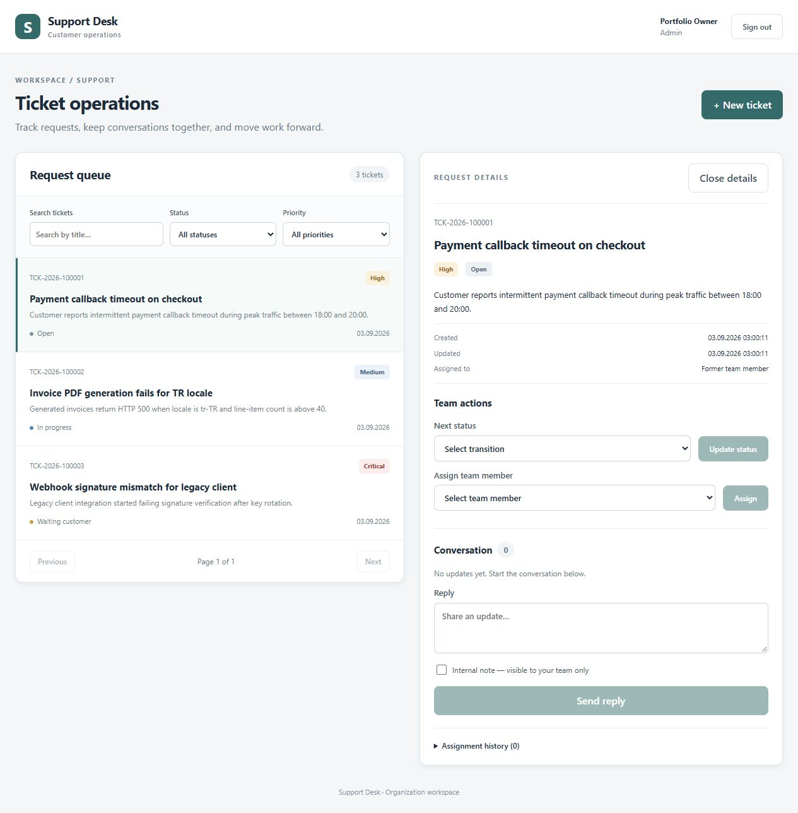

# Production security deployment — 1 October 2026

Runtime release: `9efe475e25f6727a2c258da9eed282af597cd675`.
[Green CI for that release](https://github.com/hayro45/b2b-support/actions/runs/36802883575).
The repository is public; production credentials and backup files are not.

## Changes and evidence

| Check | Observed result |
| --- | --- |
| Application tests | 24 backend + 9 frontend tests; CI also checks lint, build, npm audit and container configuration |
| Git history secrets | Gitleaks passed; only the exact intentionally public development JWT fixture is allowed, and production rejects it |
| Container vulnerabilities | Trivy 0.74.0: backend, frontend and PostgreSQL each had **0 HIGH/CRITICAL findings**, including unfixed findings, at scan time |
| Security patches | Tomcat 11.0.26; Jackson 2.21.7 / 3.1.7; patched Ubuntu runtime packages |
| PostgreSQL runtime | PostgreSQL remains 16.15; updated Alpine libraries; old Go-based privilege helper replaced with Alpine's native su-exec |
| Database compatibility | Both fresh initialization and reopening existing data verified locally and in CI |
| Private access | Demo accounts inactive; demo login 401; owner login and ADMIN role verified |
| Password storage | Zero remaining `{noop}` passwords; all accounts upgraded to BCrypt |
| Token protection | Production profile active; private JWT key rotated; token lifetime bounded; current account status/role verified per request |
| Data retention | 3 existing tickets preserved; 3 users (including new owner); 6 successful migrations; existing `infra_postgres_data` volume retained |
| Backup and restore | Before/after backups verified; private off-host copies retained; post-migration backup actually restored into a separate local QA DB with 3 tickets / 3 users / 6 migrations |
| Public API | Unauthenticated ticket request 401; repeated invalid logins produce 429 at the edge |
| Public diagnostics | OpenAPI and actuator routes return 404 through the public proxy |
| HTTPS headers | HSTS, CSP, nosniff, frame denial, referrer and permissions policies configured and checked on the live host |
| Container privileges | Backend uid999; frontend uid101; dropped capabilities and no-new-privileges; PostgreSQL drops privileges to its database user |
| Network / SSH | DB not published; app ports bound to loopback; firewall active; SSH password login disabled |
| Shared blog | Blog containers were not recreated or restarted; its site configuration and data were not changed |
| Recovery | Old checkout/operator files and previous images retained; no volumes, databases or server directories deleted |

Trivy image digest was pinned to `sha256:62b1e65e8869bc4b4c6aa4fa2b21595256c7c2f6018a9d9ad61caf87187c1969`.
CI now builds/scans all three images and verifies PostgreSQL initialization and
restart. Its release gate fails on fixable HIGH/CRITICAL findings; the additional
local final scan above did not exclude unfixed findings.

The deployment used locally tested images transferred with matching SHA-256
checksums, avoiding a resource-intensive build on the shared small host. Images
are tagged with the runtime Git revision. `/opt/b2b-support-current` selects the
active release; the legacy checkout remains untouched. Source changes were
split into backend, frontend, infrastructure, documentation and security-patch
commits, then pushed. CI deployment remains explicitly triggered, not automatic.

## Security boundaries

This is not a penetration-test certificate or a guarantee against compromise.
The image result is a time-specific dependency scan, not proof that every
application, host or supply-chain weakness has been eliminated. LOW/MEDIUM
findings and future advisories still require normal patch management.

The shared blog's application code was not fully security-audited in this pass.
Host automatic security updates are active; no kernel upgrade, reboot or SSH
access change was made. Hosting-provider controls and GitHub environment/branch
protection are not asserted as verified here.

The hosted support instance no longer has an anonymous/shared demo login. Public
portfolio review can use screenshots/source or run the local development
fixtures. Owner credentials are stored privately outside Git, never in this
report. Account/password self-service, MFA, distributed throttling, monitoring
and scheduled off-host backups remain deliberate follow-up work.
